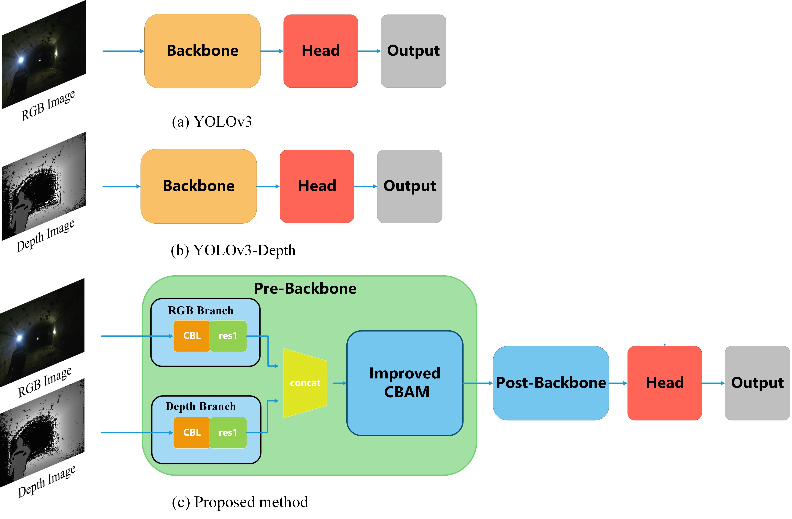
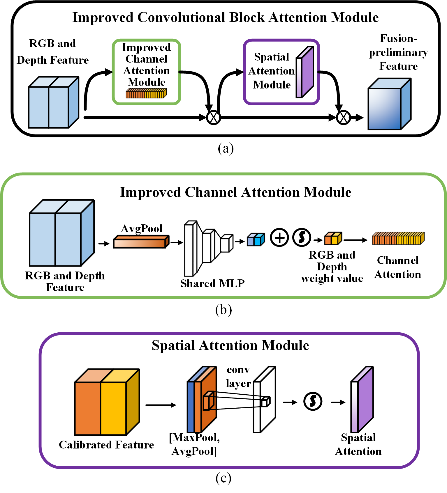

# YOLOv3-RGBD-ICBAM

> T. Huang, X. Zou, Z. Wang, H. Wu and Q. Wang, "RGBD image based human detection for electromechanical equipment in underground coal mine," 2022 IEEE International Conference on Mechatronics and Automation (ICMA), 2022, pp. 952-957, doi: 10.1109/ICMA54519.2022.9856066.[paper](https://github.com/HT-hlf/YOLOv3-RGBD-ICBAM/blob/master/paper/RGBD%20image%20based%20human%20detection%20for%20electromechanical%20equipment%20in%20underground%20coal%20mine.pdf)
>

## Code

- [Train version](https://github.com/HT-hlf/mmdetection_miner-2.22.0.git)
- [Test version](https://github.com/HT-hlf/mmdetection_miner-2.22.0-predict.git)

